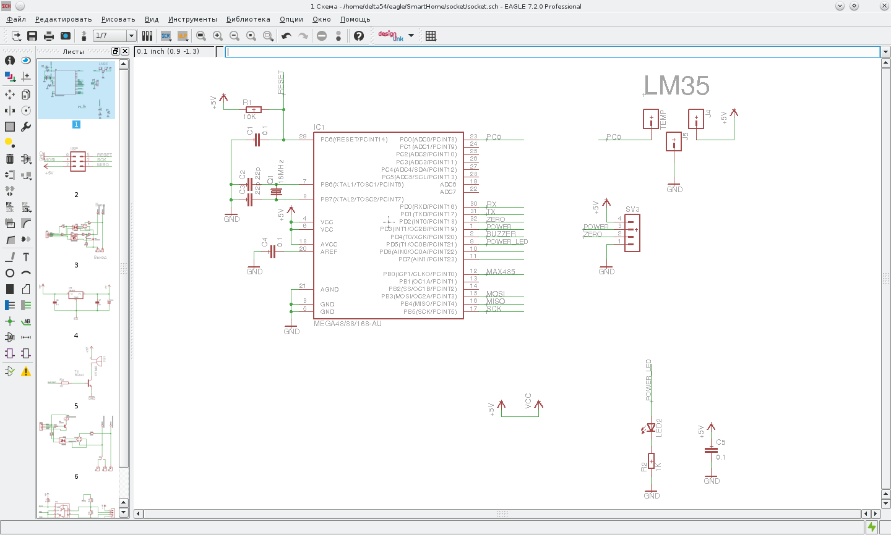
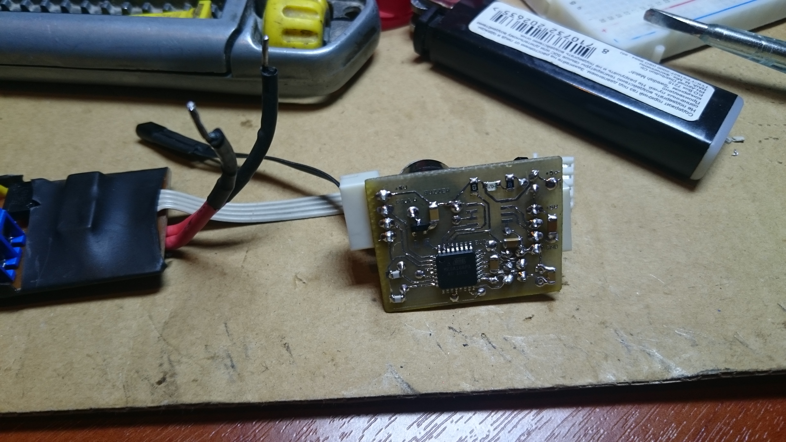
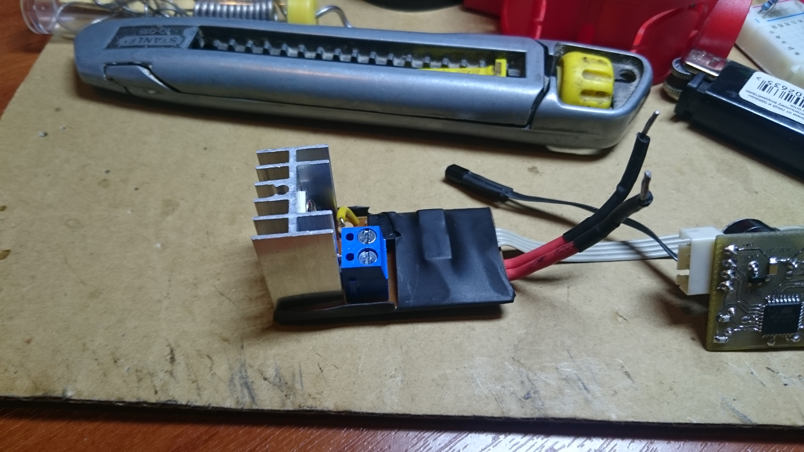
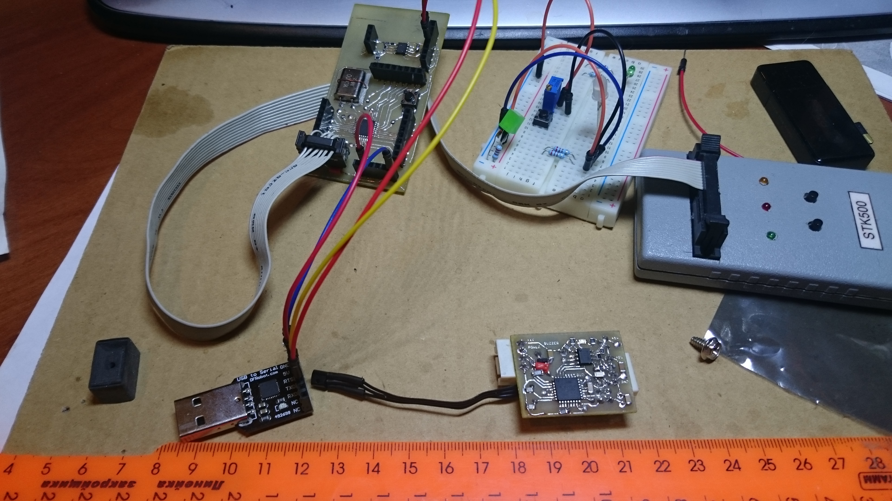
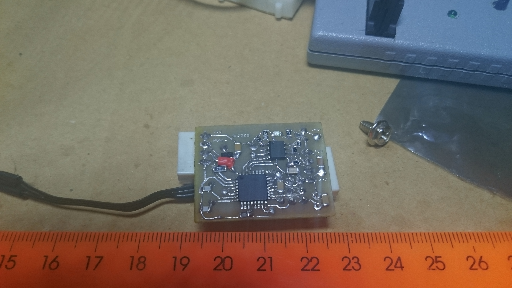

Автомат управления розетками/нагрузками
---------------------------------------

[Project site](https://e154.github.io/smart-home/) |
[Server](https://github.com/e154/smart-home/) |
[Configurator](https://github.com/e154/smart-home-configurator/) |
[Node](https://github.com/e154/smart-home-node/) |
[Development Tools](https://github.com/e154/smart-home-tools/) |
[Smart home Socket](https://github.com/e154/smart-home-socket/)

##### Функции
    Контроль температуры силового блока
    Включение/Выключения по команде управляющего сервера
    Контроль наличия сети/фазы

##### Общение с сервером
    Общение происходит по линии связи rs485, с помощью модифицированного 
    протокола MODBUS ASCII

##### Поведение автомата

    состояния:
    включен/выключен

    температура:
    в пределах нормы
    за пределами нормы

    комманды консоли:
    запрос состояния
          температура
          фаза
          вкл/выкл
          максимальный предел температуры
    включить
    выключить

##### Список компонентов

    Qty Value            Device                  Package         Parts              Description          
    1                    CPOL-EUE2,5-6E          E2,5-6E         C12                POLARIZED CAPACITOR, 
    1                    LEDCHIPLED_0805         CHIPLED_0805    LED2               LED                  
    5                    M01NOSILK-KIT           1X01NS-KIT      J1, J2, J3, J6, J7 Header 1             
    3                    M01PTH_NO_SILK_YES_STOP 1X01_NO_SILK    J4, J5, TEMP       Header 1             
    1                    MA03-2                  MA03-2          ISP                PIN HEADER           
    4                    MA04-1                  MA04-1          SV1, SV2, SV3, SV5 PIN HEADER           
    1   0.05mF           C-EUC0805               C0805           C6                 CAPACITOR, European  
    5   0.1              C-EUC0805               C0805           C1, C4, C5, C7, C8 CAPACITOR, European  
    2   10K              R-EU_M0805              M0805           R8, R12            RESISTOR, European s 
    3   10K              R-EU_R0805              R0805           R1, R13, R14       RESISTOR, European s 
    1   120R             R-EU_R0805              R0805           R17                RESISTOR, European s 
    1   16MHz            CRYSTALHC49U70          HC49U70         Q1                 CRYSTAL              
    1   1K               R-EU_M0805              M0805           R10                RESISTOR, European s 
    1   1K               R-EU_M1206              M1206           R9                 RESISTOR, European s 
    1   1K               R-EU_R0805              R0805           R2                 RESISTOR, European s 
    2   22p              C-EUC0805               C0805           C2, C3             CAPACITOR, European  
    3   330              R-EU_M0805              M0805           R3, R4, R5         RESISTOR, European s 
    1   560K             R-EU_M0805              M0805           R7                 RESISTOR, European s 
    2   560R             R-EU_R0805              R0805           R15, R16           RESISTOR, European s 
    1   78L05Z           78L05Z                  TO92            IC3                Positive VOLTAGE REG 
    2   82K              R-EU_0309/10            0309/10         R6, R11            RESISTOR, European s 
    1   AZ8-FORM-C       AZ8-FORM-C              AZ8             K1                 MINIATURE PC BOARD R 
    2   BC847            NPNSOT23                SOT-23          T2, T3             NPN TRANSISTOR       
    1   BT138-V          BT138-V                 TO220BV         T1                 TRIAC                
    2   DBDB101G         DBDB101G                DB              B1, B2             Single Phase 1.0 AMP 
    1   F/TMB            F/TMB                   F/TMB           SG1                BUZZER Source: Buerk 
    1   MAX481CSA        MAX481CSA               SO08            IC2                RS485 TRANSEIVER     
    1   MEGA48/88/168-AU MEGA48/88/168-AU        TQFP32-08       IC1                                     
    2   MKDSN1,5/2-5,08  MKDSN1,5/2-5,08         MKDSN1,5/2-5,08 X1, X2             MKDSN 1,5/ 2-5,08 Pr 
    1   MOC3031M         MOC3031M                DIL06           OK2                6-Pin DIP Zero-Cross 
    2   PC817            PC817                   DIL04           OK1, OK3           SHARP OPTO COUPLER   

##### Фоты
   

#### LICENSE

Smart home socket is licensed under the [MIT License (MIT)](https://github.com/e154/smart-home-socket/blob/master/LICENSE).